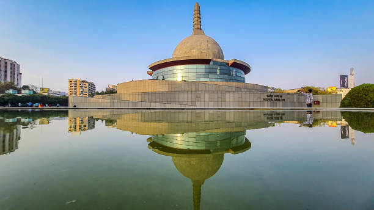

# 🌆 Visit Patna – Hometown Project

A simple and aesthetic **static website** built using **HTML and CSS** that highlights the beauty and culture of **Patna**, the capital city of Bihar, India.  
This project was created as part of a hometown showcase assignment to demonstrate layout design, CSS styling, and responsive web structure.

---

## 🚀 Live Demo
**[View Website on Netlify](https://your-netlify-link-here.netlify.app)**  

---

## 📸 Preview


---

## 🎯 Features

- 🎨 Clean and modern **aesthetic layout**
- 🌇 Attractive **hero section** with background image
- 🏞️ Highlights **top activities** to do in Patna
- 👨‍💼 Includes a **personal guide section**
- 💡 Uses a **custom gradient background** that matches the city’s color palette
- 📱 **Responsive layout** with flexbox

---

## 🛠️ Tech Stack

| Technology | Description |
|-------------|-------------|
| **HTML5** | Page structure and content |
| **CSS3 (Flexbox & Gradients)** | Styling, layout, and responsiveness |
| **Netlify** | Deployment and hosting |

---

## 🧱 Folder Structure

hometown-site/
│

├── index.html

├── style.css

└── images/

├── cityimage2.jpg

├── centreimage.jpeg

├── ecopark.jpg

├── gm.jpg

└── profilepic.jpg

---


## 📐 Design Palette

| Color | Hex Code | Usage |
|--------|-----------|--------|
| Deep Blue | `#1D3557` | Headings, accent |
| Steel Blue | `#457B9D` | Secondary sections |
| Light Teal | `#A8DADC` | Backgrounds |
| Cream White | `#F1FAEE` | Content areas |

---

## 📖 Description

The **Visit Patna** project is a minimal web design project that visually represents the cultural and recreational charm of Patna city.  
It includes:
- A **hero section** describing the city.
- A **three-activity showcase** representing fun things to do.
- A **guide section** introducing a local (yourself!) who can show hidden gems.

The design focuses on:
- Simplicity  
- Balanced color harmony  
- Easy readability  
- Smooth layout using Flexbox  

---

## 💻 How to Run Locally

Clone the repository  
   ```bash
   git clone https://github.com/yourusername/hometown-proj.git
   cd hometown-proj
   ```

Open index.html in your browser

---

🌐 Deployment (Netlify)

1.Go to Netlify

2.Click "New site from Git"

3.Connect your GitHub repository

4.Deploy using the default settings

5.Copy your live site URL and add it above under Live Demo
   

